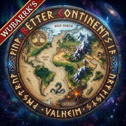

# 🗺️ Better Continents

> *"The Allfather did not carve the Tenth Realm in a single stroke. With hammer and chisel, the jagged peaks were raised, deep fjords torn open, and ancient oceans poured into the abyss. Take up the chisel, Viking, and shape the continents to your will."*

**Better Continents** is a total procedural and bitmap overhaul of Valheim's world generation. It gives world builders, server administrators, and cartographers complete control over terrain generation—allowing you to replace or augment vanilla landmasses with custom heightmaps, bespoke biome layouts, precision spawn placements, and intricate multi-layered noise. 

Whether you want to import a real-world map of Earth, recreate Middle-earth, sculpt realistic mountain ranges, or carve an unforgiving archipelago for a hardcore survival campaign, Better Continents makes it possible.

📜 <b>Contents</b>

- [⚔️ Core Features](#core-features)
  - [🏔️ Precision Heightmap Layers](#precision-heightmap-layers)
  - [🌿 Handcrafted Biome Layouts](#handcrafted-biome-layouts)
  - [🌸 Paint Alt Biomes](#paint-alt-biomes)
  - [🌲 Custom Forest Coverage](#custom-forest-coverage)
  - [📍 Absolute Location & Spawn Control](#absolute-location--spawn-control)
  - [🌊 Global Ocean & Continent Scaling](#global-ocean--continent-scaling)
  - [⚡ Multi-Layer FastNoiseLite Procedural Engine](#multi-layer-fastnoiselite-procedural-engine)
  - [🎨 In-Game World Architect UI](#in-game-world-architect-ui)
  - [💾 World File Sharing & Presets](#world-file-sharing--presets)
  - [📤 Export a World to Maps](#export-a-world-to-maps)
  - [📥 Make a World From an Export](#make-a-world-from-an-export)
- [📦 Recommended Companion Mods](#recommended-companion-mods)
- [🍗 Installation & Setup](#installation--setup)
- [🛠️ How World Generation Works](#how-world-generation-works)
  - [🗺️ Image Map Specifications](#image-map-specifications)
  - [📡 Sharing Maps With Players](#sharing-maps-with-players)
- [⚙️ Configuration & Console Commands](#configuration--console-commands)
  - [📤 World Export and Import HUD](#world-export-hud)
  - [📡 Settings Transfer Rate](#settings-transfer-rate)
- [📚 Documentation & Guides](#documentation--guides)
- [📜 Credits & History](#credits--history)
- [⚖️ License](#license)

> 🔗 Looking for seamless travel across your custom continents? Check out [TortalPortal](https://valheim.hexium.gg/mods/Wubarrk/TortalPortal) on Hexium!

---

## ⚔️ Core Features

Every map and setting below has its own chapter in `BetterContinents-Guide.pdf`, the Guide that ships in the Hexium package (see [Documentation & Guides](#documentation--guides)); the chapter is named in brackets.

### 🏔️ Precision Heightmap Layers
Shape mountains, cliffs, and ocean trenches using standard grayscale or RGB image files.
* 🌐 **Base Heightmap:** Sets the continental foundation and sea level contours (Guide: *Heightmap*).
* 🌊 **Detail Heightmap:** Adds fine-grained localized ridges, valleys, and coastal erosion (Guide: *Flatmap*).
* ⛰️ **Rough Heightmap:** Biome-specific height noise blended seamlessly with vanilla terrain (Guide: *Roughmap*).
* 🎛️ **Blend Modes:** Supports customizable blending operations including Add, Multiply, Maximum, Minimum, and Masked blending.

### 🌿 Handcrafted Biome Layouts
Forget vanilla's rigid concentric circles. Draw your world's biomes by painting a simple image map (Guide: *Biome map*):
* 🎨 Assign specific color keys to Meadows, Black Forest, Swamp, Mountain, Plains, Mistlands, Ashlands, and Deep North.
* 🏝️ Paint custom islands dedicated entirely to specific biomes, or craft seamless, realistic climate transitions.
* 🎯 **Biome precision** (working again in 0.9.0): set `Biome precision` from 1 to 5 and the ground follows your biome borders inside every 64 m terrain zone, on a grid of up to 6 x 6 cells (11 m), instead of only at the zone's corners. Ground textures, grass, vegetation and spawn points follow; heights do not change. 0 is vanilla.

### 🌸 Paint Alt Biomes (new in 0.8.1)
Valheim 1.0 layers 32 alt biomes onto regions of your world, such as Dark Meadows, Troll Black Forest, Fortress Mountain and Lox Plains. Better Continents lets you choose where they go:
* 🖌️ Paint an alt-biome map (`altbiomemap.png`) and list its colours in a legend (`altbiomemap.txt`). Every alt biome has a default colour, and the legend is written for you when it is missing.
* 🎯 Every painted area becomes a region of its own. Stack several alt biomes on one colour, keep an area free of alt biomes with `none`, or plant the region under a point with `at x, z`.
* 🎲 Choose how the game places the rest: at random on unplanted land (what you planted counts toward its limits), only what you planted, or no alt biomes at all.
* 🎨 Every release includes a palette file for Krita and GIMP (`BetterContinents.gpl`) and a printable colour chart.

### 🌲 Custom Forest Coverage
Take direct control over tree density and clearings across the realm (Guide: *Forest*):
* 🪓 Specify forest density maps, creating massive open tundra clearings in the Black Forest or thick ancient woods across the Plains.
* 🌲 Override tree generation even in biomes that are normally 100% forested (Swamps, Mistlands, Mountains).

### 📍 Absolute Location & Spawn Control
Dictate where history begins on your world (Guide: *Spawn map*):
* ⛩️ **Starting Temple:** Pinpoint the exact coordinates of the sacrificial stones and player spawn (Guide: *Start Position*).
* 💀 **Boss Altars:** Place Eikthyr, The Elder, Bonemass, Moder, Yagluth, and the Queen exactly where your design intends.
* 💰 **Traders & Dungeons:** Place Haldor, Hildir, and crypts on designated islands or mountain peaks.

### 🌊 Global Ocean & Continent Scaling
* 🌊 **Sea Level Adjustment:** Dynamically raise sea level to drown lowland continents into island archipelagos, or lower it to expose vast continental land bridges (Guide: *Global*).
* 🗺️ **Continent Size Scaling:** Scale continent frequency and landmass size independently without breaking seed coherence.

### ⚡ Multi-Layer FastNoiseLite Procedural Engine
Under the hood, Better Continents integrates a high-performance [FastNoiseLite](https://github.com/Auburn/FastNoiseLite) layer system:
* 🧩 Stack unlimited noise layers (Perlin, Simplex, Cellular/Voronoi, Value).
* 🎚️ Apply independent frequencies, fractal octaves, domain warping, and masking to each layer.

### 🎨 In-Game World Architect UI
* 🖥️ Design, preview, and adjust your world directly inside Valheim.
* 👁️ Interactive visual editor shows layer stacking, real-time height visualization, and immediate terrain regeneration.

### 💾 World File Sharing & Presets
* 📁 Worlds generated with Better Continents save alongside a companion `.BetterContinents` configuration file.
* 🤝 Anyone with the mod can load and explore your shared world identically—no external dependencies or complex editors needed.
* 🗂️ Presets are complete world recipes (settings and every map) that you pick in the **Better Continents** box of the New World screen. Every world export makes one, `bc_import` makes one from any folder of maps, and `bc savepreset` saves the loaded world's. They live in `BetterContinents/presets/` beside the game's `worlds_local` folder.
* 🌱 A world's settings and maps can be handed to players in advance as a `.bcworld` file (`bc_cache export`), so joining a huge world skips the download. See [Sharing Maps With Players](#sharing-maps-with-players).

### 📤 Export a World to Maps (new in 0.9.0)
Turn the world you are standing in, vanilla or Better Continents, into Better Continents image maps that rebuild it, ready to edit in any image editor:
* 🗺️ A 16-bit heightmap sampled the way the game builds its terrain, plus biome, location, forest, heat, alt-biome, lava, moss and ground-paint maps with their legends, and an `export.cfg` holding the settings that load them.
* 🗂️ Every export also makes a New World preset named after the world and the time, so you can create a world from it straight away. A `README.txt` in the folder explains every file and the three ways to load it, step by step.
* 📐 Heights are encoded for Heightmap Amount 2 and Sea Level 0.5 unless you choose otherwise: -30 m to 370 m, with the waterline at 0.15. That is the encoding hand-made and generated maps use, so the two can be cut and pasted into each other.
* ⏱️ It runs in the background while you play, and a cancelled export removes its partial files and its preset.
* 🖥️ Start it from the console (`bc_export`) or from the export HUD: a small status box (F9) and a window (F7) with every map explained, a size and time estimate, and a summary of the last export, modelled on Wubarrk's Eye.
* 📁 Every export gets its own folder, `BetterContinents/<world>/export-<time>/` beside the game's `worlds_local` folder, never inside the world's own save folder.

### 📥 Make a World From an Export (new in 0.9.0)
Three ways, from the easiest:
1. **Pick the preset.** In the main menu choose Start Game, pick your character and press Start, then New World; pick the export's preset (`<world> <date> <time>`) in the Better Continents box, and press Done. The preset is a copy of the folder as exported: it keeps working if you move or delete the folder.
2. **After editing the PNGs, `bc_import`.** Open the console (F5) in the main menu or in a world and type `bc_import`: it remakes the preset from your newest export as it is now and selects it. `bc_import list` numbers every export, and `bc_import 3`, `bc_import <world>` or `bc_import <folder>` picks one, including any folder of maps you made yourself. The export window's **Import** tab does the same with buttons.
3. **To keep editing, the config.** `bc_import <number> config` copies the folder's `export.cfg` into `BetterContinents.cfg` (your old file is kept beside it) and selects the preset "From Config", so every new world reads the PNGs as they are at that moment. Pasting `export.cfg` at the end of `BetterContinents.cfg` yourself does the same, with no restart.

A world that already exists keeps the maps it was created with. For step-by-step instructions written for first-timers, see `BetterContinents-Export-Guide.pdf` in the package.

---

## 📦 Recommended Companion Mods

To get the absolute most out of Better Continents, we strongly recommend pairing it with:

* 🛠️ **[Server Devcommands](https://valheim.hexium.gg/mods/JereKuusela/Server_devcommands)** — Unlocks administrative flying, god mode, and unlimited camera exploration while testing and designing your custom worlds.
* 🌍 **[Upgrade World](https://valheim.thunderstore.io/package/JereKuusela/Upgrade_World/)** — Essential for resetting zones, forcing location spawns (`location_register`), and regenerating modified map sectors on the fly.
* 🔨 **[Infinity Hammer](https://valheim.hexium.gg/mods/JereKuusela/Infinity_Hammer)** — Perfect for building custom ruins, landmarks, and settlements directly into your handcrafted terrain.
* 🌀 **[TortalPortal](https://valheim.hexium.gg/mods/Wubarrk/TortalPortal)** — The ultimate portal overhaul with destination previews, favorites, and server synchronization across massive continents.

---

## 🍗 Installation & Setup

### ⚡ Automated Installation (Recommended)
Install using **Gale** or your preferred mod manager directly from [Hexium](https://valheim.hexium.gg/mods/Wubarrk/BetterContinents).

### 🛠️ Manual Installation
1. Ensure **BepInEx for Valheim** is properly installed in your game directory.
2. Download the latest `BetterContinents.dll` release.
3. Place `BetterContinents.dll` into your `Valheim/BepInEx/plugins/` directory.
4. Dedicated servers running custom maps need Better Continents installed and the world's folder (created in the game client) in `worlds_local/`.

---

## 🛠️ How World Generation Works

### 🗺️ Image Map Specifications
Better Continents uses standard image files (PNG recommended) placed in your world configuration folder:
* 📏 **Resolution:** 2048×2048 or 4096×4096 square images provide excellent fidelity for the full Valheim world disc.
* ⚪ **Heightmaps:** Grayscale 8-bit or 16-bit PNG. Pure black (`#000000`) is maximum ocean depth; pure white (`#FFFFFF`) is the highest mountain summit.
* 🎨 **Biome Maps:** RGB PNG where distinct color codes correspond to each biome type.
* 🌳 **Forest Maps:** Grayscale PNG where white denotes maximum tree density and black denotes open clearings.

### 📡 Sharing Maps With Players
Valheim 1.0 saves each world as a folder, `worlds_local/<WorldName>/`. Better Continents stores the world's settings and image maps inside that folder, in a file named `BetterContinents` (no extension).
* To share a world with players or a dedicated server, copy the whole `<WorldName>` folder.
* A dedicated server cannot create a Better Continents world itself: create it in the game client, then copy the folder to the server.
* 📥 **Players need no copy of the world.** When a player joins, the host or dedicated server sends them the world's Better Continents settings and image maps before the join finishes, and their game caches them, so the download happens once per world revision. A detailed world is tens of megabytes, and Valheim pins every Steam connection to about 150 KB/s, so that first join can take over a minute: [`Settings Transfer Rate`](#settings-transfer-rate) raises it.
* 🌱 **Pre-seeding the cache.** `bc_cache export` writes that same data as a shareable `.bcworld` file; a player who imports it (`bc_cache import <file>`) joins with no download at all. Better Continents also imports every `.bcworld` it finds under `BepInEx/plugins/` (recursively) or in `BepInEx/config/BetterContinents/seed/` when it starts, so a mod pack that contains nothing but a `.bcworld` file (for example "MyWorld-WorldCache") pre-seeds every player who installs it, with no command to run.

---

## ⚙️ Configuration & Console Commands

Better Continents has five console commands (open the console with F5). `bc` is for building worlds: it is a cheat command, so it needs `devcommands`, and it runs only on the host. `bc_altbiomes`, `bc_export`, `bc_import` and `bc_cache` work for every player, and `bc_import` and `bc_cache` work in the main menu too.

* ⌨️ `bc info` — Prints the current world's settings.
* ⌨️ `bc reload <map>` — Reloads an image map from disk and reapplies it (`hm`, `bm`, `fom`, `lm`, `heat`, … or `all`).
* ⌨️ `bc <group> <setting> [value]` — Reads or changes a setting, for example `bc g sl 0.55`. Groups include `g` (global), `h` (heightmap), `b` (biome map), `fo` (forest) and `st` (start position).
* ⌨️ `bc scr` — Saves a screenshot of the map.
* ⌨️ `bc export run [options]`, `bc export status`, `bc export cancel` — Exports the loaded world as maps that rebuild it, shows how far it has got, or stops it.
* ⌨️ `bc import run [what] [config]`, `bc import list`, `bc import status` — The same as `bc_import`, in the `bc` tree.
* ⌨️ `bc show [filter]`, `bc hide [filter]`, `bc bosses` — Pins locations on the map, or removes the pins.
* ⌨️ `bc savepreset` — Saves the current settings as a preset.
* ⌨️ `bc ab info`, `bc ab list [filter]`, `bc ab here` — Shows what each alt biome did in this world, which regions have alt biomes, and the region you stand in.
* ⌨️ `bc ab fn [path]`, `bc reload ab` — Sets the alt-biome map, or re-reads it and its legend from disk.
* ⌨️ `bc ab mode [Random|PlantedOnly|Off]` — Sets how the game places the alt biomes you did not plant. `bc ab help` lists the rest: seed, chance, amount, overrides, export and more.
* ⌨️ `bc_altbiomes [here|names|hash|list]` — For any player: the region you stand in, the alt-biome names and colours, and whether your placement agrees with the server's. `list` needs `devcommands`.
* ⌨️ `bc_export [size] [options]`, `bc_export status`, `bc_export cancel`, `bc_export help` — The world export for any player the server allows (`Allow Export`). A client's export holds only the locations the server shows on the map; `bc_export server [options]` asks a dedicated server to export its own world, for admins only. Options: `amount=`, `sealevel=`, `heatscale=`, `edge=auto|on|off`, `forest=additive|exact`, `noheight`, `nobiomes`, `nolocations`, `noforest`, `noheat`, `noaltbiomes`, `nolava`, `nomoss`, `nopaint`, `nosources`, `nopreset`, `perpoint`.
* ⌨️ `bc_import`, `bc_import list`, `bc_import <number>`, `bc_import <world>`, `bc_import <folder>`, `bc_import ... config`, `bc_import status`, `bc_import help` — Makes a New World preset from an export (your newest one when you name none) and selects it; with `config`, loads the folder through `BetterContinents.cfg` and "From Config" instead. Works in the main menu and in a world, for any player.
* ⌨️ `bc_cache export`, `bc_cache import <file or folder>`, `bc_cache list`, `bc_cache help` — A shareable form of the world cache, for pre-seeding players before they join an extra-large world. `export` writes a `.bcworld` file plus a `.txt` description into `BetterContinents/<world>/` (on the host or a dedicated server: this world's settings; on a client: your cached copy of the world you are in); `import` copies one file, or every `.bcworld` under a folder, into your cache (ids you already have are skipped, never overwritten, and the id is computed from the file's content, never its name); `list` shows what is cached. `import` and `list` work in the main menu too, for any player.

### 📤 World Export and Import HUD
Turn on `Hud` in the `[09 BetterContinents.Export]` section of `BepInEx/config/BetterContinents.cfg`, or in Configuration Manager. In a world, **F9** shows or hides a status box: the export's progress, the last export folder, and the map pixel you stand on. **F7** opens the window, which frees the mouse while it is open. It has two tabs:
* **Export this world** — every map with a line saying what it holds (point at one for more, including what the paint map costs), all on by default. Choose 1024, 2048, 4096 or 8192 pixels, set the Heightmap Amount and Sea Level the heights are encoded for, read the size, memory and time estimate, and press **Start export**. When it finishes, the window shows what the export came to (heights, clipped pixels, missing locations, the preset) with **Copy the folder path** and **Open the folder**.
* **Import an export** — your export folders, newest first. **Make preset** builds a New World preset from the one you pick and selects it; **Use as config** loads it through `BetterContinents.cfg` and "From Config" instead.

The `[09 BetterContinents.Export]` settings:
* `Hud` (off) — Shows the export HUD.
* `Allow Export` (on) — Whether players connected to this server may export the world. The machine that runs the world always may: single player, the host, and a dedicated server's own console.
* `Hud Hotkey` (F9) and `Window Hotkey` (F7) — `None` turns a key off.
* `Default Size` (4096), `Default Heightmap Amount` (2) and `Default Sea Level` (0.5) — What `bc_export` and the export window use unless told otherwise.

These settings apply at once. Better Continents reads `BetterContinents.cfg` again whenever the file changes on disk, and Configuration Manager changes apply straight away. On a client connected to a server that runs Better Continents 0.9.0 or later, the server's `Hud` and `Allow Export` replace the client's own, and a change on the server reaches connected players immediately. Every other Better Continents setting is a default for new worlds: an edit is read at once, but it only changes worlds created afterwards.

### 📡 Settings Transfer Rate
`Settings Transfer Rate` (KB512), in `[07 BetterContinents.Misc]` — How fast this machine (the host, or a dedicated server) sends a joining player's Better Continents settings and images over their Steam connection: `Vanilla` (Valheim's own ~150 KB/s), `KB256`, `KB384`, `KB512`, `KB768`, `MB1`, `MB1_5`, `MB3` or `Unlimited` (100 MB/s). The rate is set on that one connection for the transfer only, then Valheim's own is restored.
* **Steam sends at exactly the rate set**, with no congestion control, so pick one the server's upload can carry. The transfer itself moves about 4 MB/s at most. Measured on a local dedicated server with an 11.8 MB world: `Vanilla` 78 s, `KB512` 23 s, `Unlimited` 3 s.
* **Server enforced:** only the value on the sending machine matters. A client's own value has no effect.
* PlayFab (crossplay) connections cannot be raised at all and are sent at Valheim's rate; the log says so once.
* The value is read when a player joins, and the file is re-read when it changes, so a new value applies to the next player who joins, without a restart.
* The log shows `Settings transfer rate: 512 KB/s (server setting)` when a transfer starts and `Settings sent: <bytes> in <seconds> (<KB/s>)` when it ends.

---

## 📚 Documentation & Guides

For deep dives, tutorials, and configuration references:
* 📕 **The Better Continents Guide for 0.9.x:** `BetterContinents-Guide.pdf`, included in this package, with a clickable table of contents.
* 📗 **Export & Import, the easy guide, for 0.9.x:** `BetterContinents-Export-Guide.pdf`, included in this package: illustrated, step-by-step instructions written for first-timers: exporting a world, editing the pictures, cutting and pasting between worlds, Biome precision, and making new worlds from an export.
* 🤖 **Map-making, a skill for AI agents, for 0.9.x:** `BetterContinents-AI-Skill.pdf`, included in this package: hand it to an AI agent (Claude, Gemini or another) and it learns the whole map-making craft for Valheim 1.0: what the game demands of a map, how to make one read as natural geography, the generator and checker toolkit (attached inside the PDF), world export and import, and the traps.
* 🎨 **Colour scheme:** `BetterContinents.gpl` (a palette for Krita and GIMP with every biome and alt-biome colour) and `altbiome-palette.png` (a printable colour chart), included in this package.
* 🚀 **Setup & Quick Start**, ❓ **FAQ**, and a chapter for every image map and every setting — all in the same guide, with a clickable table of contents. The older online docs by Jere Kuusela describe Better Continents 0.7.x (no Valheim 1.0 Deep North, no lava map, no alt-biome planting, no export); everything in them is in the PDF, updated for Valheim 1.0.
* 🌿 [Alt biomes in Better Continents 0.8.1](https://github.com/RGlabs84/BetterContinents10/blob/main/ALTBIOMES.md) — planting alt biomes with colours: the legend syntax, the colour scheme, the quota rule, the commands and the log lines.
* 🔧 [Valheim 1.0 migration notes](https://github.com/RGlabs84/BetterContinents10/blob/main/MIGRATE-1.0.md) — what changed for Valheim 1.0 and what has been verified in play.
* 💬 [Community Discord Server](https://discord.gg/3XW8ZntYzN)

---

## 📜 Credits & History

* 👑 Originally created by **billw2012** — the pioneer of Valheim heightmap and custom continent generation.
* 🛠️ Maintained and expanded by **JereKuusela**.
* ⚡ Modernized for Valheim 1.0 by **Wubarrk**.

---

## ⚖️ License

* **Better Continents** is free software under the **GNU Lesser General Public License v2.1** (`LICENSE.md`). Source code: [github.com/RGlabs84/BetterContinents10](https://github.com/RGlabs84/BetterContinents10). This package includes the exact source of this release as `BetterContinents-source.zip`.
* `BetterContinents.dll` also contains ImageSharp (Apache-2.0), five .NET libraries (MIT) and FastNoiseLite (MIT). Their notices are in `THIRD-PARTY-NOTICES.txt`.
* `BetterContinents-Guide.pdf` is the Better Continents Guide, originally written by billw2012 and maintained by JereKuusela, updated for Valheim 1.0 by Wubarrk. It is licensed under the **GNU General Public License v3** (`GUIDE-LICENSE.txt`), and its source files are attached inside the PDF.
* `BetterContinents-Export-Guide.pdf` is *Better Continents: Export & Import, the easy guide*, written by Wubarrk with Claude (Anthropic) as the drafting agent. It is licensed under the **GNU General Public License v3** (`GUIDE-LICENSE.txt`), and its source files and pictures are attached inside the PDF.
* `BetterContinents-AI-Skill.pdf` is *Better Continents map-making: a skill for AI agents*, written by Wubarrk with Claude (Anthropic) as the drafting agent. It is licensed under the **GNU General Public License v3** (`GUIDE-LICENSE.txt`), and its source files and toolkit are attached inside the PDF.
