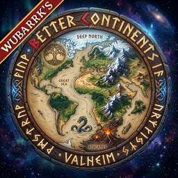

# 🗺️ Better Continents

> *"The Allfather did not carve the Tenth Realm in a single stroke. With hammer and chisel, the jagged peaks were raised, deep fjords torn open, and ancient oceans poured into the abyss. Take up the chisel, Viking, and shape the continents to your will."*

**Better Continents** is a total procedural and bitmap overhaul of Valheim's world generation. It gives world builders, server administrators, and cartographers complete control over terrain generation—allowing you to replace or augment vanilla landmasses with custom heightmaps, bespoke biome layouts, precision spawn placements, and intricate multi-layered noise. 

Whether you want to import a real-world map of Earth, recreate Middle-earth, sculpt realistic mountain ranges, or carve an unforgiving archipelago for a hardcore survival campaign, Better Continents makes it possible.

> ⬆️ **Updating from 0.9.x?** Worlds you already have keep generating as they did under 0.9.4; only worlds made with 0.10 get the new behaviour. [What changes and what does not](#upgrading-from-09).

📜 <b>Contents</b>

- [⬆️ Upgrading from 0.9: existing worlds and new worlds](#upgrading-from-09)
  - [Which version is my world?](#which-version-is-my-world)
  - [Mixing versions](#mixing-versions)
  - [Your BetterContinents.cfg](#your-bettercontinents-cfg)
- [⚔️ Core Features](#core-features)
  - [🏔️ Precision Heightmap Layers](#precision-heightmap-layers)
  - [🌿 Handcrafted Biome Layouts](#handcrafted-biome-layouts)
  - [🌸 Paint Alt Biomes](#paint-alt-biomes)
  - [🌲 Custom Forest Coverage](#custom-forest-coverage)
  - [📍 Absolute Location & Spawn Control](#absolute-location--spawn-control)
  - [🌊 Global Ocean & Continent Scaling](#global-ocean--continent-scaling)
  - [📏 Worlds of Any Size](#worlds-of-any-size)
  - [⚡ Multi-Layer FastNoiseLite Procedural Engine](#multi-layer-fastnoiselite-procedural-engine)
  - [🎨 In-Game World Architect UI](#in-game-world-architect-ui)
  - [💾 World File Sharing & Presets](#world-file-sharing--presets)
  - [📤 Export a World to Maps](#export-a-world-to-maps)
  - [📥 Make a World From an Export](#make-a-world-from-an-export)
  - [🧭 Map Mods & No-Map Worlds](#map-mods--no-map-worlds)
  - [👯 Vegetation Twin Guard](#vegetation-twin-guard)
  - [🗜️ Maps in Memory & Compact Maps](#maps-in-memory--compact-maps)
- [📦 Recommended Companion Mods](#recommended-companion-mods)
- [🍗 Installation & Setup](#installation--setup)
- [🛠️ How World Generation Works](#how-world-generation-works)
  - [🗺️ Image Map Specifications](#image-map-specifications)
  - [📡 Sharing Maps With Players](#sharing-maps-with-players)
- [⚙️ Configuration & Console Commands](#configuration--console-commands)
  - [🛠️ Debug Mode & Zone Regeneration](#debug-mode--zone-regeneration)
  - [📤 World Export and Import HUD](#world-export-hud)
  - [📡 Settings Transfer Rate](#settings-transfer-rate)
- [📚 Documentation & Guides](#documentation--guides)
- [📜 Credits & History](#credits--history)
- [⚖️ License](#license)

> 🔗 Looking for seamless travel across your custom continents? Check out [TortalPortal](https://valheim.hexium.gg/mods/Wubarrk/TortalPortal) on Hexium!

---

## ⬆️ Upgrading from 0.9: existing worlds and new worlds

An existing world keeps generating its terrain, biomes and locations as it did under 0.9.4, though not through a separate "0.9.4 mode": every world stores a settings version in its `BetterContinents` file, 0.10 reads it, and each new-world behaviour in the table below switches on only for version 12, which is what 0.10 gives a world it creates. A world made by 0.9.x is version 11, so it follows the 0.9.4 rules and is saved as 0.9.4 saved it. A few changes reach every world, old or new, and are marked "Applies too": memory use, water depth, the edge of the world, zone regeneration after `bc` changes and the config do not change what a world's settings generate, and the vegetation twin guard changes only the vegetation of zones that are not generated yet.

In the table, a "world made with 0.10" is a version 12 world. Not every world made in 0.10 is one: a world made from a preset of version 11 or older (the four presets that ship with the mod are version 7 files, and presets saved by 0.9.x are version 11), from an export of a world resized under 0.9.x or made under Expand World Size at another size, or with `Override version` 11 is version 11, and so belongs in the 0.9.x column (see [Which version is my world?](#which-version-is-my-world)).

| Behaviour | World made with 0.9.x (version 11) | World made with 0.10 (version 12) |
| --- | --- | --- |
| **Terrain and maps** | | |
| What the maps span | 21,000 m, whatever `World Size` says | 2 × (`World Size` + `Edge Size`), the land dropping away over `Edge Size`; 21,000 m at the default 10000 / 500 |
| `Heightmap Alpha` (off by default) | On: the heightmap is read as 8-bit grey and the alpha is not used. Off: 16-bit grey | On: 16-bit grey with a 16-bit alpha, blended with the game's own terrain (opaque = the heightmap, transparent = the game's terrain). Off: 16-bit grey |
| **Biomes and Expand World Data** (its rows apply only where it is installed) | | |
| `Biome precision` | Up to 5 (cells of about 11 m); a higher value is stored but used as 5 | Up to 31 (cells of 2 m). The config and `bc` accept 0 to 31 for every world |
| Expand World Data: altitude rules | The maps' heights replace them (except where the rough map is white) | They apply over the maps' heights, as over the game's own |
| Expand World Data: `lava: true` biomes (a biome map and no heat map) | Only the Ashlands are hot | They are hot too: lava burns and the Ashlands weather applies |
| Expand World Data: grounds | A terrain legend that names one of its biomes reads as a bad colour (a warning, Meadows ground); precision's colour replaces a territory's | The name becomes that biome's ground colour; precision keeps a territory's ground colour |
| Expand World Data: biomes on a biome map | Stored by number, so renumbering its yaml swaps biomes | Stored with their names and followed if the numbers move; a biome it no longer has reads as None |
| **Locations and the start** | | |
| Location map pins (fixed when the world is made) | At the corner of one pixel of the pin picked at random, up to a pixel south-west of where the other maps put it; shared colours dealt out at random | On the pixel nearest the pin's middle, where the other maps put it; shared colours dealt out the same way every time. A world export's pins are still read at the corner |
| Start override and a pin in the same 64 m zone | The pin wins and the start is dropped (0.10 logs an error) | The start is placed first and the pin is dropped |
| **World size and layout** | | |
| Layout: alt-biome grid, location search, biome bands, Ashlands and Deep North rings, lakes, streams, minimap | Vanilla's; `World Size` only moves the game's edge | Scaled to the world when `World Size` or `Edge Size` is not 10000 / 500; the alt-biome `Grid` setting has no effect |
| The game's edge (kill zone, ship push-back, water edge) | Applies too | Follows each world's own `World Size`, applied again for every world loaded in a session (0.9.4 could keep the first world's) |
| Expand World Size installed | Its size spans the maps and it lays the world out | The same: its size wins over the world's own |
| **Storage and memory** | | |
| Maps in memory | Applies too | Held as 128 × 128 tiles, a tile of one value (open sea) as that value, so a large world takes far less memory; every value reads as before |
| `Compact Maps` (experimental) | Not available: a version 11 world is never compact | Only if on when the world is made: maps saved and sent compressed, and the world keeps it for good |
| The world file | Saved as version 11, as 0.9.4 saves it | Version 12; 0.9.x reads it as version 11 and cannot read a Compact Maps one ([Mixing versions](#mixing-versions)) |
| **Vegetation and water** | | |
| Vegetation twin guard | Applies too | In zones generated from now on, a plant is not placed within 1 m of the same kind of object already there (standing before, or placed by another entry in the same pass). Vegetation only; zones already generated keep what they have |
| Water depth | Applies too | A zone's water takes the depth of its ground when the ground is rebuilt in place (look and wave size only) |
| **The `bc` commands** | | |
| Zone regeneration after `bc` changes and on `bc regen` | Applies too | Runs in single player or on the host, in a world that uses Better Continents (never in a vanilla world), and uses the world's own settings, so an older world edited with `bc` keeps its 0.9.x rules. `bc h alpha`, `bc reload lm` and `bc reload terrain` re-read their map at once, by the world's own rule |
| **Export and import** | | |
| Exporting a world | Applies too | `Default Heightmap Amount` is 1 (was 2); `heightmap.png` records its Amount and Sea Level |
| A `.bcworld` file | Accepted by 0.9.x and 0.10 | Accepted by 0.10 only; 0.9.x refuses it as a bad header |
| **Config** | | |
| `BetterContinents.cfg` | Applies too | Read as it is; its one-time changes touch only the file, never a world file ([Your BetterContinents.cfg](#your-bettercontinents-cfg)). While `Override version` is set, every save writes that version ([Which version is my world?](#which-version-is-my-world)) |

Most rows matter only when you use the feature. At the default `World Size` 10000 and `Edge Size` 500, with no Expand World Data, no `Heightmap Alpha`, `Biome precision` of 5 or less and no location map, a version 12 world generates the same as a version 11 one.

### Which version is my world?
* **Read it.** `bc info` (console, F5; `bc` needs `devcommands` and runs only on the host) prints `Version 11` or `Version 12` first; on a joined player's machine, with the Server Devcommands mod, it shows the settings the server sent. The BepInEx log (`BepInEx/LogOutput.log`) prints the settings, whose first line is that `Version` line, when a world loads (single player, the host or a dedicated server), when a new world is created, on the server each time it sends the settings to a joining player who has no cached copy, and on a joining player's machine when the server's settings arrive (downloaded or from its cache). A save prints nothing there: the game saves on a background thread whose log lines never reach the file, though the world's `BetterContinents` file is still written at every save. A default-size version 12 world prints no "maps span" line, so the `Version` line is the one to read. The Esc-menu hint shows only the mod version and ENABLED or DISABLED. A world with no `BetterContinents` file in its folder is vanilla and has no version. A world from a much older Better Continents shows a number below 11 until it is loaded again after its first save (a save writes 11 but never changes the number the loaded world holds), as under 0.9.x.
* **From Config** (no export folder): a new world is version 12, unless `Override version` says otherwise (below).
* **A preset file:** the world gets the preset's version, saved as at least 11 (while `Override version` is set, every world is saved in that version instead: see below). A preset saved by 0.9.x makes version 11; one saved by 0.10 from a version 12 world (`bc savepreset`), or made by `bc_import` or an export, makes version 12 (11 by the export rule below). **The four presets that ship with the mod (Continents, Pangaea, Swirls, Vanillaish) are old version 7 files, so a world made from one is version 11.** They hold no map files and vanilla's size, where the two versions generate alike.
* **A `Directory`** (`[00 BetterContinents.Debug]`):
  * A folder with an `export.cfg` (a world export), and likewise `bc_import` and an export's own preset, gives version 12 when its maps span what its own `World Size` + `Edge Size` give (an export of a version 12 world, or of a vanilla-size 0.9.x world), and otherwise version 11 (an export of a resized 0.9.x world, or one made under Expand World Size at another size). A version 11 world's maps span 21,000 m, as a resized 0.9.x world's did, unless Expand World Size is installed, whose size then spans them: an export made under Expand World Size is rebuilt as it was only with Expand World Size installed at that size.
  * A folder of maps you made yourself, with no `export.cfg`, makes a new world, version 12. The same files give a slightly different world than 0.9.4 made from them (exact pins, start before pins, the alpha blend, finer precision, Expand World Data's rules); set `Override version` to 11 before you create the world to get the 0.9.4 result.
* **`Override version`** (`[00 BetterContinents.Debug]`, empty by default, for testing): a whole number of 11 or more is the version a From Config world gets. It is also the version every world is saved in while it is set, one made from a preset too (only the preset file that `bc_import` or an export builds ignores it), and the one a host sends to joining players: 11 re-saves a version 12 world as 11, which loses what 12 added from its next load, and 12 re-stamps a version 11 world, so new zones follow the 0.10 rules and seams are likely where they meet old ones. A number below 11 writes the old fixed layout and drops data. Leave it empty, on a server above all.
* **No upgrade from 11 to 12.** Nothing in 0.10 converts an existing world; only `Override version` re-stamps one at a save, which is not recommended.

### Mixing versions
* **Multiplayer.** On a world that uses Better Continents, the server and every player must run exactly the same version of the mod, whatever the world's settings version: a 0.9.x player cannot join a 0.10 server and a 0.10 player cannot join a 0.9.x server, and two different 0.10 releases refuse each other too. A world without Better Continents has no check. Players play the settings version the server sends, whatever their own config says. Update the server and every player together; a player's cached copy of a version 11 world stays valid, so it is not downloaded again.
* **A version 12 world opened in 0.9.x** is not supported: copy the world folder first. 0.9.x reads it as version 11 (maps spanning 21,000 m whatever `World Size` says, no layout, the heightmap's alpha read as 8 bits, and so on), so zones generated from then on follow the 0.9.x rules: a world of non-default size can show seams, and the pins already in the world stay. Its next save writes the world as version 11, and from then on 0.10 treats it as made by 0.9.x. A world made with Compact Maps cannot be read at all: 0.9.x switches Better Continents off for it, generates vanilla terrain that stays in the world, and leaves the file alone. A preset saved by 0.10 loads in 0.9.x as a version 11 world (a Compact Maps one makes a world without Better Continents).
* **A 0.9.x world in 0.10 and back.** With `Override version` empty, 0.10 writes a version 11 world's file exactly as 0.9.4 does, so the world opens in 0.9.x as before. `BetterContinents.old` beside the file holds only the save before the last: back up `worlds_local/<World>` before changing versions.

### Your BetterContinents.cfg
0.10 reads your existing file as it is: every key keeps its name and section (two are gone, below) and the new keys appear in it. Except where noted, a setting is a default for worlds you create afterwards; an existing world uses what it stored.
* `[09 BetterContinents.Export]` `Default Heightmap Amount` of 2 (0.9's default) is set to 1 once, with a line in the log; set it back and it stays. The hidden `Config Version` in `[07 BetterContinents.Misc]` records the step.
* `Fix Water Color` and `Ocean Channels` (`[01 BetterContinents.Global]`) are gone, with the `bc g fixwatercolor` command: the first never did anything and the second matters only to settings formats 1 to 6. A world that saved them still loads them.
* New in `[07 BetterContinents.Misc]`: `Compact Maps` (off) and `Map Memory` (512 MB).
* `Debug Reset Command` (`[00 BetterContinents.Debug]`) is empty by default, because Better Continents regenerates the zones itself; the old default `zones_reset start` is set to empty once.
* `Spawnmap File` is only the creature spawn map: it is no longer moved into `Locationmap File`, and no `spawnmap.png` is renamed to `locationmap.png`.
* A new file selects the preset `Disabled`; an existing `Vanilla` stays and still makes a world without Better Continents, with an error in the log.
* Ranges: `Start Position X` and `Y` take -1,000,000 to 1,000,000 m (the config stopped at 10,500); `Biome precision` takes 0 to 31 (a version 11 world uses at most 5).
* `Override version` is read at every save, so editing it changes the next autosave of a loaded world.

---

## ⚔️ Core Features

Every map and setting below has its own chapter in `BetterContinents-Guide.pdf`, the Guide that ships in the Hexium package (see [Documentation & Guides](#documentation--guides)); the chapter is named in brackets.

Where a feature below says *new worlds* or *a world made since 0.10*, it means a settings version 12 world; the worlds you already have keep generating as under 0.9.4. [Upgrading from 0.9](#upgrading-from-09) says which worlds are which and which changes reach every world.

### 🏔️ Precision Heightmap Layers
Shape mountains, cliffs, and ocean trenches using standard grayscale or RGB image files.
* 🌐 **Base Heightmap:** Sets the continental foundation and sea level contours (Guide: *Heightmap*). Use a 16-bit grayscale PNG for smooth slopes. `Heightmap Amount` (1 by default, Better Continents' default everywhere) says how tall white is: a pixel gives `(pixel / 65535 * Amount - 0.15 + Lerp(1, -1, Sea Level Adjustment)) * 200` metres on the game's height scale, where the sea is at 30 m. At Sea Level Adjustment 0.5, Amount 1 spans -30 m to 170 m on that scale (60 m below the water to 140 m above it) and clips higher ground, and Amount 2 spans -30 m to 370 m (60 m below to 340 m above), which keeps every vanilla mountain.
* 🔆 **Heightmap Alpha** (new worlds, new in 0.10): with it on, a new world reads a 16-bit grayscale heightmap with a 16-bit alpha, and the alpha blends the heightmap with the game's own terrain: where a pixel is transparent, the game's terrain shows. A version 11 world keeps reading the heightmap at 8 bits with it on and ignores the alpha, as it always did; with it off every world reads 16-bit grayscale.
* 🌊 **Detail Heightmap (legacy):** Fine-grained detail for worlds made by old versions of Better Continents (Guide: *Flatmap*). A new world gets its fine procedural detail from height layers instead.
* ⛰️ **Rough Heightmap:** Where it is white the biomes' own rough ground shows through the heightmap, and where it is black the heightmap stays smooth; used with Heightmap Override All off (Guide: *Roughmap*).
* 🎛️ **Blend Modes:** Supports customizable blending operations including Add, Multiply, Maximum, Minimum, and Masked blending.

### 🌿 Handcrafted Biome Layouts
Forget vanilla's rigid concentric circles. Draw your world's biomes by painting a simple image map (Guide: *Biome map*):
* 🎨 Assign specific color keys to Meadows, Black Forest, Swamp, Mountain, Plains, Mistlands, Ashlands, and Deep North.
* 🏝️ Paint custom islands dedicated entirely to specific biomes, or craft seamless, realistic climate transitions.
* 🎯 **Biome precision** (working again in 0.9.0): set `Biome precision` from 1 to 5 and the ground follows your biome borders inside every 64 m terrain zone, on a grid of up to 6 x 6 cells (11 m), instead of only at the zone's corners. A version 12 world goes on up to 31, a grid of 32 x 32 cells of 2 m. Ground textures, grass, vegetation and spawn points follow; heights do not change. 0 is vanilla.
* 🧬 **Expand World Data biomes** (working again in 0.9.3): name the biomes Expand World Data adds in the biome map's legend (`biomemap.txt`) as its `expand_biomes.yaml` does, for example `DeadWastes: 8B4513`. Give each one a `terrain` in the yaml (without one Expand World Data leaves its ground flat under water). Install Expand World Data wherever the world is played, with the same yaml, and add new biomes at its end: it numbers them in that order, and the world stores the number.
* 🏷️ **Expand World Data on new worlds** (new in 0.10): its altitude rules (a biome's or territory's altitude multiplier and delta, water depth, height limits and lava dip) apply over the heightmap's heights, as they do over the game's own. With a biome map and no heat map (or Heatmap Scale 0), its `lava: true` biomes are hot where the biome map puts them; a heat map decides by heat. The terrain map's legend (`terrainmap.txt`) can name one of its biomes for a ground colour, for example `DeadWastes: 8B4513`, and Biome precision keeps its territories' ground colours. The world also saves the names of the biomes its biome map adds and follows them if Expand World Data numbers its biomes differently later: a biome it no longer has reads as None.

### 🌸 Paint Alt Biomes (new in 0.8.1)
Valheim 1.0 layers 32 alt biomes onto regions of your world, such as Dark Meadows, Troll Black Forest, Fortress Mountain and Lox Plains. Better Continents lets you choose where they go:
* 🖌️ Paint an alt-biome map (`altbiomemap.png`) and list its colours in a legend (`altbiomemap.txt`). Every alt biome has a default colour, and the legend is written for you when it is missing.
* 🎯 Every painted area becomes a region of its own. Stack several alt biomes on one colour, keep an area free of alt biomes with `none`, or plant the region under a point with `at x, z`.
* 🎲 Choose how the game places the rest: at random on unplanted land (what you planted counts toward its limits), only what you planted, or no alt biomes at all.
* 🎨 Every release includes a palette file for Krita and GIMP (`BetterContinents.gpl`) and a printable colour chart.
* 🌍 A new world's alt-biome grid covers the whole world, however big (see [Worlds of Any Size](#worlds-of-any-size)). `Mode` = `Off` means no alt biomes, not no grid: Valheim builds its grid for every world.

### 🌲 Custom Forest Coverage
Take direct control over tree density and clearings across the realm (Guide: *Forest*):
* 🪓 Specify forest density maps, creating massive open tundra clearings in the Black Forest or thick ancient woods across the Plains.
* 🌲 Override tree generation even in biomes that are normally 100% forested (Swamps, Mistlands, Mountains).

### 📍 Absolute Location & Spawn Control
Dictate where history begins on your world (Guide: *Spawn map*):
* ⛩️ **Starting Temple:** Pinpoint the exact coordinates of the sacrificial stones and player spawn (Guide: *Start Position*). `Start Position X` and `Start Position Y` accept -1,000,000 to 1,000,000 m, for worlds bigger than vanilla's.
* 💀 **Boss Altars:** Place Eikthyr, The Elder, Bonemass, Moder, Yagluth, and the Queen exactly where your design intends.
* 💰 **Traders & Dungeons:** Place Haldor, Hildir, and crypts on designated islands or mountain peaks.
* 📌 **Exact pins** (new worlds, new in 0.10): a pin on the location map lands exactly on its pixel, where the height and biome maps put it. A pin of several pixels lands on the one nearest its middle, and locations that share a colour are dealt out the same way every time. The start position is placed before the pins, so a pin in its zone cannot take it. A world made from a world export reads its pins where the export wrote them.

### 🌊 Global Ocean & Continent Scaling
* 🌊 **Sea Level Adjustment:** Dynamically raise sea level to drown lowland continents into island archipelagos, or lower it to expose vast continental land bridges (Guide: *Global*).
* 🗺️ **Continent Size:** Scales the features of the height layers' noise (Guide: *Global*): a higher value makes them smaller, and 0.5 leaves them as they are. It does not scale a heightmap.

### 📏 Worlds of Any Size (new in 0.10)
On a version 12 world, `World Size` and `Edge Size` (in `[01 BetterContinents.Global]`; vanilla's are 10000 and 500) lay out the whole world, not only its edge:
* 🗺️ **The maps span World Size + Edge Size** in each direction, and the land drops away over the edge. A version 11 world keeps vanilla's 21,000 m whatever its World Size says: there World Size only moves the game's edge (the kill zone, the ship's push back and the water's edge).
* 🧭 **The rest of the world is laid out to the size too:** the alt-biome grid (12 m points out to the edge, so locations reach the whole world) and the minimap follow World Size + Edge Size; where locations are searched for, the game's own biome bands, the Ashlands and Deep North rings, and the lakes and stream sources follow World Size. Terrain detail keeps its size. `Grid` in `[08 BetterContinents.AltBiomes]` has no effect on such a world.
* 🧮 **A bigger world costs more each time it loads:** it builds a bigger alt-biome grid, on the server and on every client as it joins, which takes longer and about 0.2 GB at a radius of 16,350 m. Valheim builds the grid for every world, so `Mode` = `Off` means no alt biomes, not no grid.
* 📐 **The practical maximum is World Size + Edge Size of 16,350 m.** The game files every object beyond about 16.35 km from the centre under one shared sector.
* 🔌 **With Expand World Size installed,** it sizes and lays out the world as before (its size, grid, minimap and locations) and Better Continents leaves the layout to it. Install it on every machine that plays the world or on none, and do not add it to a world Better Continents laid out. Its World Stretch magnifies Better Continents' maps, so that only their centre shows (the log warns once, on any Better Continents world); keep it at 1.
* ℹ️ `bc info` says when a world's maps follow World Size.

### ⚡ Multi-Layer FastNoiseLite Procedural Engine
Under the hood, Better Continents integrates a high-performance [FastNoiseLite](https://github.com/Auburn/FastNoiseLite) layer system:
* 🧩 Stack unlimited noise layers (Perlin, Simplex, Cellular/Voronoi, Value).
* 🎚️ Apply independent frequencies, fractal octaves, domain warping, and masking to each layer.

### 🎨 In-Game World Architect UI
* 🖥️ Design, preview, and adjust your world directly inside Valheim.
* 👁️ Interactive visual editor shows layer stacking, real-time height visualization, and immediate terrain regeneration.
* 🔄 After each change made here or with the `bc` commands, Better Continents regenerates the world's zones itself, leaving the zones around what players built or worked, and around other players: see [Debug Mode & Zone Regeneration](#debug-mode--zone-regeneration).

### 💾 World File Sharing & Presets
* 📁 A world generated with Better Continents keeps its settings and maps inside its own save folder, in a file named `BetterContinents` (see [Sharing Maps With Players](#sharing-maps-with-players)).
* 🤝 Anyone with the mod can load and explore your shared world identically—no external dependencies or complex editors needed. On a world that uses Better Continents the server and every player must run exactly the same version of the mod (see [Mixing versions](#mixing-versions)).
* 🗂️ Presets are complete world recipes (settings and every map) that you pick in the **Better Continents** box of the New World screen. Every world export makes one, `bc_import` makes one from any folder of maps, and `bc savepreset` saves the loaded world's. They live in `BetterContinents/presets/` beside the game's `worlds_local` folder. A preset keeps the settings version it was saved with, so a preset made before 0.10 still makes the world it always made; the four that ship with the mod (Continents, Pangaea, Swirls and Vanillaish) are old version 7 files and make version 11 worlds ([Which version is my world?](#which-version-is-my-world)).
* 🌱 A world's settings and maps can be handed to players in advance as a `.bcworld` file (`bc_cache export`), so joining a huge world skips the download; only 0.10 accepts the file of a version 12 world. See [Sharing Maps With Players](#sharing-maps-with-players).

### 📤 Export a World to Maps (new in 0.9.0)
Turn the world you are standing in, vanilla or Better Continents, into Better Continents image maps that rebuild it, ready to edit in any image editor:
* 🗺️ A 16-bit heightmap sampled the way the game builds its terrain, plus biome, location, forest, heat, alt-biome, lava, moss and ground-paint maps with their legends, and an `export.cfg` holding the settings that load them.
* 🗂️ Every export also makes a New World preset named after the world and the time, so you can create a world from it straight away. A `README.txt` in the folder explains every file and the ways to load it, step by step.
* 📐 Heights are encoded for Heightmap Amount 1 and Sea Level 0.5 unless you choose otherwise (`Default Heightmap Amount` in `[09 BetterContinents.Export]`, or `amount=` in `bc_export`): -30 m to 170 m on the game's height scale (its sea is at 30 m, so that is 60 m below the water to 140 m above it), with the waterline at 0.30 of the pixel range. That is the encoding a map made at Better Continents' default settings uses, so exports and such maps can be cut and pasted into each other. Ground above 170 m on that scale (140 m above the water) is clipped, and the export says how many pixels; `amount=2` spans -30 m to 370 m (up to 340 m above the water) and keeps every vanilla mountain.
* 🏷️ The exported `heightmap.png` records the Heightmap Amount and Sea Level Adjustment its heights are encoded for, in a PNG text chunk that image editors show and often keep. A new world that reads it at other settings warns in the log, and `bc info` shows the record.
* ⏱️ It runs in the background while you play, and a cancelled export removes its partial files and its preset.
* 🖥️ Start it from the console (`bc_export`) or from the export HUD: a small status box (F9) and a window (F7) with every map explained, a size and time estimate, and a summary of the last export, modelled on Wubarrk's Eye.
* 📁 Every export gets its own folder, `BetterContinents/<world>/export-<time>/` beside the game's `worlds_local` folder, never inside the world's own save folder.

### 📥 Make a World From an Export (new in 0.9.0)
Four ways, from the easiest:
1. **Pick the preset.** In the main menu choose Start Game, pick your character and press Start, then New World; pick the export's preset (`<world> <date> <time>`) in the Better Continents box, and press Done. The preset is a copy of the folder as exported: it keeps working if you move or delete the folder.
2. **After editing the PNGs, `bc_import`.** Open the console (F5) in the main menu or in a world and type `bc_import`: it remakes the preset from your newest export as it is now and selects it. `bc_import list` numbers every export, and `bc_import 3`, `bc_import <world>` or `bc_import <folder>` picks one, including any folder of maps you made yourself. The export window's **Import** tab does the same with buttons.
3. **To keep editing, the config.** `bc_import <number> config` copies the folder's `export.cfg` into `BetterContinents.cfg` (your old file is kept beside it) and selects the preset "From Config", so every new world reads the PNGs as they are at that moment. Pasting `export.cfg` at the end of `BetterContinents.cfg` yourself does the same, with no restart. `export.cfg` lists `Override version` (empty), so an `Override version` you had set is cleared.
4. **Or point `Directory` at the folder** (since 0.9.4). Set `Directory` in `BetterContinents.cfg` to the export folder and create the world with "From Config": the folder's `export.cfg` comes with the maps and wins over your own settings for the keys it lists (edit or delete it to use your own; the log lists what it changed). Before 0.9.4 only the maps came, so an export encoded for Heightmap Amount 2 and loaded at 1 came out almost all ocean.

A world that already exists keeps the maps it was created with. A world made from an export is a version 12 world when the export's maps span what its own `World Size` + `Edge Size` give, as an export of a version 12 world and a 0.9.x export of a world of vanilla's size do. Otherwise (an export of a resized 0.9.x world, or one made under Expand World Size at another size) it is a version 11 world: its maps span 21,000 m, as a version 11 world's do (an export made under Expand World Size is rebuilt as it was only with Expand World Size installed at that size), and it gets none of the new-world behaviour ([Which version is my world?](#which-version-is-my-world)). For step-by-step instructions written for first-timers, see `BetterContinents-Export-Guide.pdf` in the package.

### 🧭 Map Mods & No-Map Worlds (new in 0.9.2)
* 🗺️ The minimap is finished before the game hands it to other mods. It is still drawn on several CPU cores at once; the loading screen simply waits for it, as it does for vanilla's own map.
* 📜 **ZenMap:** cartography tables with hidden biomes and the admin map show the real land and sea, as crafted parchment maps already did. Before 0.9.2, ZenMap copied the map before Better Continents had drawn it, so the tables showed meadows and plains as sea.
* 🕯️ **No-map worlds:** mods that show players a map only at a table or on a parchment, or give admins their map back, get the finished map on every join.
* 🧩 Any mod that reads, copies or restyles the minimap when it loads sees the finished map, and mods that hook the game's map drawing run once, after it is done.

### 👯 Vegetation Twin Guard (new in 0.10)
The game fills a zone with trees, bushes, rocks and the like from the world seed, the zone and each plant's name. A zone filled a second time over its own objects (a command that fills zones again, or a save put back together from mismatched files) draws every spot again, and everything in it is doubled: two copies of one plant on one spot.
* 🛡️ **The guard:** in every world made with Better Continents, old ones included, a plant is not placed within 1 m of the same kind of object already standing in its zone, or placed there by another vegetation entry in the same pass. It changes vegetation only, never terrain, and only in zones generated from now on; zones already generated keep what they have. One entry never blocks itself, so vanilla's densities and groups stay for every prefab with one entry, except beside an object of that prefab that already stands in its zone (one of a location placed just before, or of an earlier fill); where two entries place the same prefab (for example a vegetation map's, or an alt biome's added vegetation) a second plant within 1 m of the first is dropped, so such a zone can hold fewer plants than in 0.9.4.
* 🧹 **`bc_twins`** finds and removes the doubles a world already has (see [Configuration & Console Commands](#configuration--console-commands)): the copy nearest the ground stays, nothing a player built is ever removed, and removal runs where the world is.

### 🗜️ Maps in Memory & Compact Maps (new in 0.10)
* 🧱 **Tiles, in every world:** Better Continents holds its pixel maps (heights, biomes, forest, spawns, paint, terrain and the rest) in memory as tiles of 128 x 128 pixels, and a tile of one value, such as open sea, is held as that one value. Every value reads exactly as before. Measured on a real 10,501 px heightmap, forest map and biome map, a world holds about 99 MB instead of about 1.32 GB.
* 🗜️ **Compact Maps (experimental, off by default, new worlds only):** `Compact Maps` in `[07 BetterContinents.Misc]`. On, a world made while it is on keeps its maps compressed in memory, decodes each tile when it is first read, and saves and sends its maps compressed: on that same map set the world file shrinks from 126 MB to 10.5 MB, and a loaded world holds about 21 MB. It is read only when a world is made (From Config, `bc_import`, or a Directory's `export.cfg`), and a world keeps it for good. **Better Continents 0.9 cannot read such a world:** it would generate its terrain as vanilla.
* 🧠 **`Map Memory`** (also in `[07 BetterContinents.Misc]`; 512 MB by default, 64 to 65536): how much memory this machine lets the decoded tiles of those worlds take. Past it, the tiles read least recently are dropped and decoded again when read again. It applies at once and does nothing for any other world.

---

## 📦 Recommended Companion Mods

To get the absolute most out of Better Continents, we strongly recommend pairing it with:

* 🛠️ **[Server Devcommands](https://valheim.hexium.gg/mods/JereKuusela/Server_devcommands)** — Unlocks administrative flying, god mode, and unlimited camera exploration while testing and designing your custom worlds.
* 🌍 **[Upgrade World](https://valheim.thunderstore.io/package/JereKuusela/Upgrade_World/)** — Commands for resetting zones, forcing location spawns (`location_register`), and regenerating sectors of a world you are building. It works alongside Better Continents: Better Continents regenerates the zones by itself after a `bc` change, and if you write `zones_reset start` in `Debug Reset Command`, it runs Upgrade World's command instead (see [Debug Mode & Zone Regeneration](#debug-mode--zone-regeneration)).
* 🔨 **[Infinity Hammer](https://valheim.hexium.gg/mods/JereKuusela/Infinity_Hammer)** — Perfect for building custom ruins, landmarks, and settlements directly into your handcrafted terrain.
* 🌀 **[TortalPortal](https://valheim.hexium.gg/mods/Wubarrk/TortalPortal)** — The ultimate portal overhaul with destination previews, favorites, and server synchronization across massive continents.

---

## 🍗 Installation & Setup

### ⚡ Automated Installation (Recommended)
Install using **Gale** or your preferred mod manager directly from [Hexium](https://valheim.hexium.gg/mods/Wubarrk/BetterContinents).

### 🛠️ Manual Installation
1. Ensure **BepInEx for Valheim** is properly installed in your game directory.
2. Download the latest `BetterContinents.dll` release.
3. Place `BetterContinents.dll` into your `Valheim/BepInEx/plugins/` directory.
4. Dedicated servers running custom maps need Better Continents installed and the world's folder (created in the game client) in `worlds_local/`.

---

## 🛠️ How World Generation Works

### 🗺️ Image Map Specifications
Better Continents uses standard image files (PNG recommended) placed in your world configuration folder:
* 📏 **Resolution:** 2048×2048 or 4096×4096 square images provide excellent fidelity for the full Valheim world disc. A map covers the whole world: 2 × (`World Size` + `Edge Size`) across, which is 21,000 m on a vanilla-sized world and on every version 11 world.
* ⚪ **Heightmaps:** Grayscale 8-bit or 16-bit PNG (16-bit gives smooth slopes). Pure black (`#000000`) is maximum ocean depth; pure white (`#FFFFFF`) is the highest mountain summit, at the height `Heightmap Amount` sets.
* 🎨 **Biome Maps:** RGB PNG where distinct color codes correspond to each biome type.
* 🌳 **Forest Maps:** Grayscale PNG where white denotes maximum tree density and black denotes open clearings.

### 📡 Sharing Maps With Players
Valheim 1.0 saves each world as a folder, `worlds_local/<WorldName>/`. Better Continents stores the world's settings and image maps inside that folder, in a file named `BetterContinents` (no extension).
* To share a world with players or a dedicated server, copy the whole `<WorldName>` folder.
* A dedicated server cannot create a Better Continents world itself: create it in the game client, then copy the folder to the server.
* 📥 **Players need no copy of the world.** When a player joins, the host or dedicated server sends them the world's Better Continents settings and image maps before the join finishes, and their game caches them, so the download happens once per world revision. A detailed world is tens of megabytes, and Valheim pins every Steam connection to about 150 KB/s, so that first join can take over a minute: [`Settings Transfer Rate`](#settings-transfer-rate) raises it.
* 🌱 **Pre-seeding the cache.** `bc_cache export` writes that same data as a shareable `.bcworld` file; a player who imports it (`bc_cache import <file>`) joins with no download at all. The file keeps the world's settings version, so one of a version 12 world is accepted by 0.10 only: 0.9.x refuses it as a bad header. Better Continents also imports every `.bcworld` it finds under `BepInEx/plugins/` (recursively) or in `BepInEx/config/BetterContinents/seed/` when it starts, so a mod pack that contains nothing but a `.bcworld` file (for example "MyWorld-WorldCache") pre-seeds every player who installs it, with no command to run.
* 🗜️ **Compact Maps** (experimental, new worlds): a world made with `Compact Maps` on saves and sends its maps compressed, far smaller than the pictures: see [Maps in Memory & Compact Maps](#maps-in-memory--compact-maps).

---

## ⚙️ Configuration & Console Commands

Better Continents has six console commands (open the console with F5). `bc` is for building worlds: it is a cheat command, so it needs `devcommands`, and it is registered for the host only. The Server Devcommands mod lets any player with `devcommands` type it on their own machine, but on a joined player's machine a `bc` change alters only that player's copy of the settings and their own view of the ground, never the world or the other players, and the zone regeneration refuses there ("it runs on the machine that runs the world"). Make `bc` changes on the host or in single player. `bc info` on a joined player's machine shows the settings the server sent. `bc_altbiomes`, `bc_export`, `bc_import`, `bc_cache` and `bc_twins` work for every player, and `bc_import` and `bc_cache` work in the main menu too. `bc <group> help` lists a group, for example `bc h help`. When an admin sends a command to a dedicated server (`bc_export server ...`, `bc_twins server ...`), its answer comes back to the admin's own console as well as the server's log.

* ⌨️ `bc info` — Prints the current world's settings, including whether its maps span World Size and the record in an export's heightmap.
* ⌨️ `bc regen` — Regenerates the zones now, the way every change does: every generated zone is reset and generates again with the current settings when someone comes near, except the zones that hold something to keep: what players built or worked, a tombstone, other players, or you inside a dungeon. Players, what players built, tombstones and tamed animals are never removed, and the loaded terrain is left as it is (see [Debug Mode & Zone Regeneration](#debug-mode--zone-regeneration)).
* ⌨️ `bc reset` — Redraws the minimap (revealing all of it), rebuilds the alt-biome grid and the loaded terrain, then regenerates the zones as `bc regen` does. Most changes do all of that for you.
* ⌨️ `bc reload <map>` — Reloads an image map from disk and reapplies it (`hm`, `bm`, `fom`, `lm`, `heat`, … or `all`).
* ⌨️ `bc <group> <setting> [value]` — Reads or changes a setting, for example `bc g sl 0.55`. Groups include `g` (global), `h` (heightmap), `b` (biome map), `fo` (forest) and `st` (start position). `bc h alpha` decodes the loaded heightmap again at once, in every world, by that world's own rule.
* ⌨️ `bc scr` — Saves a screenshot of the map.
* ⌨️ `bc export run [options]`, `bc export status`, `bc export cancel` — Exports the loaded world as maps that rebuild it, shows how far it has got, or stops it.
* ⌨️ `bc import run [what] [config]`, `bc import list`, `bc import status` — The same as `bc_import`, in the `bc` tree.
* ⌨️ `bc cache [export | import <file or folder> | list | help]`, `bc twins [radius | remove [confirm] [radius] | server ... | help]` — The same as `bc_cache` and `bc_twins`, in the `bc` tree.
* ⌨️ `bc show [filter]`, `bc hide [filter]`, `bc bosses` — Pins locations on the map, or removes the pins.
* ⌨️ `bc savepreset` — Saves the current settings as a preset.
* ⌨️ `bc ab info`, `bc ab list [filter]`, `bc ab here` — Shows what each alt biome did in this world, which regions have alt biomes, and the region you stand in.
* ⌨️ `bc ab fn [path]`, `bc reload ab` — Sets the alt-biome map, or re-reads it and its legend from disk.
* ⌨️ `bc ab mode [Random|PlantedOnly|Off]` — Sets how the game places the alt biomes you did not plant. `bc ab help` lists the rest: seed, chance, amount, overrides, export and more.
* ⌨️ `bc_altbiomes [here|names|hash|list]` — For any player: the region you stand in, the alt-biome names and colours, and whether your placement agrees with the server's. `list` needs `devcommands`.
* ⌨️ `bc_export [size] [options]`, `bc_export status`, `bc_export cancel`, `bc_export help` — The world export for any player the server allows (`Allow Export`). A client's export holds only the locations the server shows on the map; `bc_export server [options]` asks a dedicated server to export its own world, for admins only. Options: `amount=` (the `Default Heightmap Amount`, 1, unless given), `sealevel=`, `heatscale=`, `edge=auto|on|off`, `forest=additive|exact`, `noheight`, `nobiomes`, `nolocations`, `noforest`, `noheat`, `noaltbiomes`, `nolava`, `nomoss`, `nopaint`, `nosources`, `nopreset`, `perpoint`.
* ⌨️ `bc_import`, `bc_import list`, `bc_import <number>`, `bc_import <world>`, `bc_import <folder>`, `bc_import ... config`, `bc_import status`, `bc_import help` — Makes a New World preset from an export (your newest one when you name none) and selects it; with `config`, loads the folder through `BetterContinents.cfg` and "From Config" instead. Works in the main menu and in a world, for any player.
* ⌨️ `bc_twins [radius]`, `bc_twins remove [radius]`, `bc_twins remove confirm [radius]`, `bc_twins server ...`, `bc_twins help` — Finds and removes doubled vegetation, two copies of one plant on one spot. `bc_twins` counts twins by prefab and zone, exact (on one spot) and near (within the radius: 1 m unless you give one, 0.1 to 5 m); any player counts what their machine holds. `remove` shows what a cleanup would delete, and `remove confirm` deletes the extra copies, 1000 a frame: the copy nearest the ground stays, nothing a player built is ever removed, crops players grow go only when they stand on one spot, and without a radius only exact twins go. Removal runs where the world is: single player, the host, or a dedicated server through `bc_twins server ...` (admins only). Back the world up first.
* ⌨️ `bc_cache export`, `bc_cache import <file or folder>`, `bc_cache list`, `bc_cache help` — A shareable form of the world cache, for pre-seeding players before they join an extra-large world. `export` writes a `.bcworld` file plus a `.txt` description into `BetterContinents/<world>/` (on the host or a dedicated server: this world's settings; on a client: your cached copy of the world you are in); `import` copies one file, or every `.bcworld` under a folder, into your cache (ids you already have are skipped, never overwritten, and the id is computed from the file's content, never its name); `list` shows what is cached. `import` and `list` work in the main menu too, for any player.

### 🛠️ Debug Mode & Zone Regeneration
Turn on `Debug Mode` in `[00 BetterContinents.Debug]` (off by default) to edit a world's settings live with the `bc` commands. In a world that uses Better Continents, on the machine that runs the world (single player or the host), it turns `devcommands` on when you spawn, which the `bc` commands need, shows "Better Continents Debug Mode Enabled!" at the top left, and adds a **Better Continents** button to the Esc menu and the large map that opens the settings window (**Alt+F8** does the same while the Esc menu or the large map is open, and does nothing elsewhere). It does not reveal the map: most `bc` changes do that, as they redraw the minimap and explore all of it. Leave it off for a world you play. Every change you make with the window or with `bc` applies to the loaded world at once. The game fills a zone once and then keeps it, so after each change, and on `bc regen`, Better Continents also regenerates the world's zones itself. That belongs to the `bc` commands, not to Debug Mode: it runs whenever they do, and they only need cheats on, by Debug Mode or by typing `devcommands`.
* 🔄 **Every generated zone is reset,** except the zones within one zone (the 3 x 3 around) of something a player built, a tombstone, ground a player has worked (fields, paths, roads, levelled or dug ground), or you while you are inside a dungeon. A player connected from another machine keeps the zones their game has loaded around them (their simulation distance: the 5 x 5 block with the game's default, never less than the 3 x 3). That is checked as the work goes, so a player who moves keeps the zones around where they are now, and something you build while it runs keeps its zone from then on. The ground around your own character on the surface is regenerated too.
* 🏘️ **A location that reaches into more than one zone is kept or regenerated whole:** if one of its zones stays, the others stay with it. When a location is regenerated, the parts of it that stand in a zone nobody has generated yet are cleared with it, so regenerating again does not leave a second copy.
* 🧍 **Players, what players built, tombstones and tamed animals are never removed.** Crops are kept with their field. A tree a player grew from a sapling counts as the world's, so it goes unless something nearby keeps its zone.
* ⛰️ **The ground follows the new settings everywhere, kept zones included.** The ground of every zone is built from the world's settings, so after a change it follows them, also under a base and in the zones around it; the edits players made with the hoe, the cultivator or the pickaxe are stored as changes to the ground and ride on the new ground. A change that lowers the ground under a base leaves its pieces standing in the air, and the game breaks a piece that has lost its support a few seconds later (in a test, a workbench and a floor left about 3 m up were gone 8 seconds later); a change that raises the ground buries them, and the trees and rocks of kept zones float or sink the same way. So make big height changes before you build, or away from what you want to keep. `bc regen` on its own changes no ground.
* 🌱 **Each reset zone generates again with the new settings, its locations included, when someone comes near.**
* ⏱️ **The work is spread over frames,** so the game keeps running, and the console shows a line when it starts, progress lines on the way and a line when it finishes. A new change, or `bc regen` again, while it runs starts it over, after the zone it was in is finished. If the world is saved while it runs, the zones it has emptied are saved as not generated, and a location is never saved half cleared, so nothing is saved half empty: the emptied zones generate again when someone comes near. If an error stops the work, the zones it had emptied and left waiting for their neighbours are finished, so they generate again when someone comes near, and the zones it had not reached are as they were: `bc regen` resets them.

A zone that was already reset is not brought back when something is built beside it later. A location whose home zone the game generates while the work is running (someone came near it) can end up half placed, or placed twice; `bc regen` again sets it right.

Zone regeneration runs in single player or on the host, in a world that uses Better Continents. Better Continents never resets the zones of a world without it, which is the game's own: there `bc regen` says "Zone regeneration: this world does not use Better Continents." and rebuilds nothing.

`bc regen` does the same on demand, without rebuilding the loaded terrain: nothing changed, so the ground already matches the settings. A change made with the `bc` commands or the settings window (any setting, `bc reset`, an alt-biome change, a map reload or `Biome precision`) rebuilds the loaded terrain once first (the distant terrain and the grass too, and a zone that is loading at that moment) and then regenerates the zones. That stalls the game for a second or two (1.6 s measured); the regeneration itself is spread over frames. `bc reset` redraws the minimap and rebuilds the alt-biome grid first; `bc regen` does neither. Use the `bc` commands on a test world, or back the world up first.

`Debug Reset Command` in the same section is empty by default: Better Continents regenerates the zones itself. A console command written there runs instead, after each change and on `bc regen` (for example `zones_reset start`, Upgrade World's). A `BetterContinents.cfg` that still holds the old default, `zones_reset start`, is set to empty once, with a line in the log that says how to go back.

### 📤 World Export and Import HUD
Turn on `Hud` in the `[09 BetterContinents.Export]` section of `BepInEx/config/BetterContinents.cfg`, or in Configuration Manager. In a world, **F9** shows or hides a status box: the export's progress, the last export folder, and the map pixel you stand on. **F7** opens the window, which frees the mouse while it is open. It has two tabs:
* **Export this world** — every map with a line saying what it holds (point at one for more, including what the paint map costs), all on by default. Choose 1024, 2048, 4096 or 8192 pixels, set the Heightmap Amount and Sea Level the heights are encoded for, read the size, memory and time estimate, and press **Start export**. When it finishes, the window shows what the export came to (heights, clipped pixels, missing locations, the preset) with **Copy the folder path** and **Open the folder**.
* **Import an export** — your export folders, newest first. **Make preset** builds a New World preset from the one you pick and selects it; **Use as config** loads it through `BetterContinents.cfg` and "From Config" instead.

The `[09 BetterContinents.Export]` settings:
* `Hud` (off) — Shows the export HUD.
* `Allow Export` (on) — Whether players connected to this server may export the world. The machine that runs the world always may: single player, the host, and a dedicated server's own console.
* `Hud Hotkey` (F9) and `Window Hotkey` (F7) — `None` turns a key off.
* `Default Size` (4096), `Default Heightmap Amount` (1) and `Default Sea Level` (0.5) — What `bc_export` and the export window use unless told otherwise. A `BetterContinents.cfg` that still holds the old default of 2 is set to 1 once, and the log says so.

These settings apply at once. Better Continents reads `BetterContinents.cfg` again whenever the file changes on disk, and Configuration Manager changes apply straight away. On a client connected to a server that runs Better Continents 0.9.0 or later, the server's `Hud` and `Allow Export` replace the client's own, and a change on the server reaches connected players immediately. Every other Better Continents setting is a default for new worlds: an edit is read at once, but it only changes worlds created afterwards. The exceptions are `Settings Transfer Rate` and `Map Memory` in `[07 BetterContinents.Misc]`, which apply at once too, and `Override version` in `[00 BetterContinents.Debug]`, which is read at every save and every join: an edit changes the next autosave of a loaded world and the version a host sends to joining players, so leave it empty.

### 📡 Settings Transfer Rate
`Settings Transfer Rate` (KB512), in `[07 BetterContinents.Misc]` — How fast this machine (the host, or a dedicated server) sends a joining player's Better Continents settings and images over their Steam connection: `Vanilla` (Valheim's own ~150 KB/s), `KB256`, `KB384`, `KB512`, `KB768`, `MB1`, `MB1_5`, `MB3` or `Unlimited` (100 MB/s). The rate is set on that one connection for the transfer only, then Valheim's own is restored.
* **Steam sends at exactly the rate set**, with no congestion control, so pick one the server's upload can carry. The transfer itself moves about 4 MB/s at most. Measured on a local dedicated server with an 11.8 MB world: `Vanilla` 78 s, `KB512` 23 s, `Unlimited` 3 s.
* **Server enforced:** only the value on the sending machine matters. A client's own value has no effect.
* PlayFab (crossplay) connections cannot be raised at all and are sent at Valheim's rate; the log says so once.
* The value is read when a player joins, and the file is re-read when it changes, so a new value applies to the next player who joins, without a restart.
* The log shows `Settings transfer rate: 512 KB/s (server setting)` when a transfer starts and `Settings sent: <bytes> in <seconds> (<KB/s>)` when it ends.

---

## 📚 Documentation & Guides

For deep dives, tutorials, and configuration references:
* 📕 **The Better Continents Guide for 0.10.x:** `BetterContinents-Guide.pdf`, included in this package, with a clickable table of contents.
* 📗 **Export & Import, the easy guide, for 0.10.x:** `BetterContinents-Export-Guide.pdf`, included in this package: illustrated, step-by-step instructions written for first-timers: exporting a world, editing the pictures, cutting and pasting between worlds, Biome precision, and making new worlds from an export.
* 🤖 **Map-making, a skill for AI agents, for 0.10.x:** `BetterContinents-AI-Skill.pdf`, included in this package: hand it to an AI agent (Claude, Gemini or another) and it learns the whole map-making craft for Valheim 1.0: what the game demands of a map, how to make one read as natural geography, the generator and checker toolkit (attached inside the PDF), world export and import, and the traps.
* 🎨 **Colour scheme:** `BetterContinents.gpl` (a palette for Krita and GIMP with every biome and alt-biome colour) and `altbiome-palette.png` (a printable colour chart), included in this package.
* 🚀 **Setup & Quick Start**, ❓ **FAQ**, and a chapter for every image map and every setting — all in the same guide, with a clickable table of contents. The older online docs by Jere Kuusela describe Better Continents 0.7.x (no Valheim 1.0 Deep North, no lava map, no alt-biome planting, no export); everything in them is in the PDF, updated for Valheim 1.0.
* 🌿 [Alt biomes in Better Continents](https://github.com/RGlabs84/BetterContinents10/blob/main/ALTBIOMES.md) — planting alt biomes with colours: the legend syntax, the colour scheme, the quota rule, the commands and the log lines, and what a world laid out to its World Size changes.
* 🔧 [Valheim 1.0 migration notes](https://github.com/RGlabs84/BetterContinents10/blob/main/MIGRATE-1.0.md) — what changed for Valheim 1.0 and what has been verified in play.
* 💬 [Community Discord Server](https://discord.gg/3XW8ZntYzN)

---

## 📜 Credits & History

* 👑 Originally created by **billw2012** — the pioneer of Valheim heightmap and custom continent generation.
* 🛠️ Maintained and expanded by **JereKuusela**.
* ⚡ Modernized for Valheim 1.0 by **Wubarrk**.

---

## ⚖️ License

* **Better Continents** is free software under the **GNU Lesser General Public License v2.1** (`LICENSE.md`). Source code: [github.com/RGlabs84/BetterContinents10](https://github.com/RGlabs84/BetterContinents10). This package includes the exact source of this release as `BetterContinents-source.zip`.
* `BetterContinents.dll` also contains ImageSharp (Apache-2.0), five .NET libraries (MIT) and FastNoiseLite (MIT). Their notices are in `THIRD-PARTY-NOTICES.txt`.
* `BetterContinents-Guide.pdf` is the Better Continents Guide, originally written by billw2012 and maintained by JereKuusela, updated for Valheim 1.0 by Wubarrk. It is licensed under the **GNU General Public License v3** (`GUIDE-LICENSE.txt`), and its source files are attached inside the PDF.
* `BetterContinents-Export-Guide.pdf` is *Better Continents: Export & Import, the easy guide*, written by Wubarrk with Claude (Anthropic) as the drafting agent. It is licensed under the **GNU General Public License v3** (`GUIDE-LICENSE.txt`), and its source files and pictures are attached inside the PDF.
* `BetterContinents-AI-Skill.pdf` is *Better Continents map-making: a skill for AI agents*, written by Wubarrk with Claude (Anthropic) as the drafting agent. It is licensed under the **GNU General Public License v3** (`GUIDE-LICENSE.txt`), and its source files and toolkit are attached inside the PDF.
